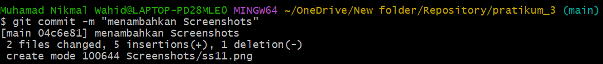

# Pratikum_3
## Cara Membuat Repository

### Buka Web Broser
Buka Web broser lalu ketik dan Buka github, Jika anda Belum memiliki akun maka buat terlebih dahulu 

### Masuk ke halaman Web
Setelah Masuk Ke halaman web klik new repository untuk membuat repository 

### Buat Repository
Buatlah Repository nya lalu pilih opsi publik dan jangan lupa pilih Add a README file 

### Instal Git Dekstop
Setelah melakukan semua langkah anda bisa mengInstal git dekstop 

## Membuat Folder
Buatlah Folder baru lalu buka folder tersebut lalu klik kanan dan pilih opsi git bash 

### Git bash
Setelah membuka git bash anda bisa ketik pwd untuk memulai 

### Selanjutnya Git Clone
Setelah pwd berhasil selanjutkan ke langkah git clone dan salin link dari repository anda 

### Membuat File HTML
Jika Sudah terdapat File README.md buka file tersebut menggunakan Visual Studio Code. Setelah itu, buat file baru dengan format HTML. 

### Buka kembali Git Bush
Setelah membuat file baru buka kembali git bush dan ketik git add file pratikum.html jika sudah langkah selanjutnya adalah melakukan git status untuk mengecek statusnya. Langkah selanjutnya adalah git commit 

### Git Config
Jika anda tidak bisa melakukan git commit maka anda harus melakukan git config pada email dan nama anda. Setelah itu Repository siap di gunakan. 

### Menambahkan Foto 
Jika ingin menambahkan foto ketik git add lalu ketikkan link foto yang ingin anda masukkan 

### Git add README
Setelah melakukan kedua langkah di atas, selanjutnya ketik git add readme.md  

 

### Langkah Selanjutnya
Langkah Selanjutnya adalah melakukan git commit apabila git commit berhasil maka anda bisa melakukan langkah selanjutnya yaitu git push. 

 